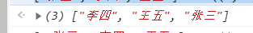
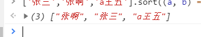
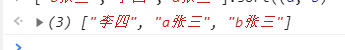

# JS 中文排序
> js的中文排序方法

```javascript
['张三','李四','王五'].sort((a, b) => a.localeCompare(b, 'zh-Hans-CN', {sensitivity: 'accent'}))
```
<br/>
中文之间按照拼音的字母顺序进行排序

```javascript
['张三','张啊','a王五'].sort((a, b) => a.localeCompare(b, 'zh-Hans-CN', {sensitivity: 'accent'}))
```
<br/>
排序是按照中文优先，英文在后的顺序进行

```javascript
['b张三','李四','a张三'].sort((a, b) => a.localeCompare(b, 'zh-Hans-CN', {sensitivity: 'accent'}))
```
<br/>
英文之间按照字母序列进行排序